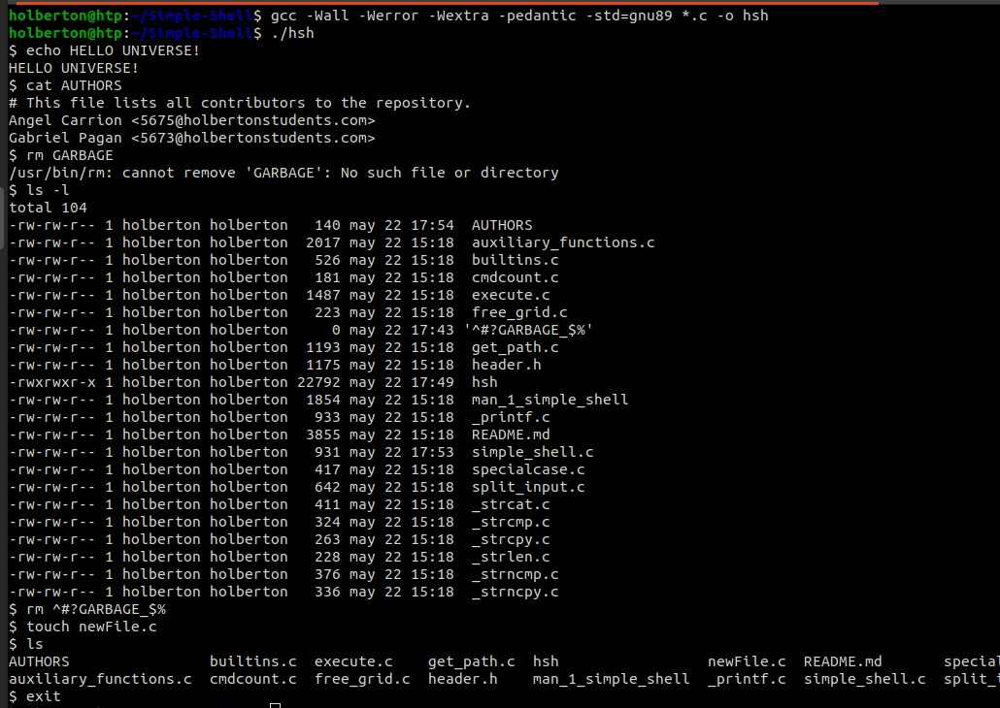

# Simple Shell <div id="badges"> <a href="https://www.linkedin.com/in/gabriel-pagan-232570254/"></a>
### Introduction
#### This is a project created as part of Holberton School curriculum. It consisted in writing a simple shell version in C language using a limited number of functions and system calls. To help us through the creation of this interpreter, we used some of our own custome functions that we created in these past three months as part of the Holberton low level program. [See repository here](https://github.com/AngelJCT/holbertonschool-low_level_programming).
#### The goal of this project was to help us understand how a shell works and to challenge us to use everything learned form the past three months.
#### A shell is a command-line interpreter that allows the user to interact with the operating system. It provides a simple interface for entering and executing comamnds, and allows users to navigate the files system, run programs and perform various tasks. NOTE that our shell is just a simple version and doesn't perform as a full interpreter.



### Usage
#### To run this program:
***1) clone the repo***
```
git@github.com:GabrielPaganMateo/holbertonschool-simple_shell.git
```
***2) and compile it with***
```
gcc -Wall -Werror -Wextra -pedantic -std=gnu89 *.c -o hsh
```
### How to use it
#### This shell can be used in Interactive and Non-Interactive mode. In order to use this shell in a terminal, first run the executable program.
```
./hsh
```
#### It will display a prompt and wait for a command.
```
$
```
#### This shell can handle the following commands:
```
1. /bin/ls
This will display a list of files inside the current directory.

2. ls
This will display a list of files inside the current directory without specifying the PATH.

3. ls -l
This will display a long format list of each file.

4. ls -l /tmp
This will display a long format list in current directory.

5. env
This will display curent environment.

6. exit
This will close the prompt and get you back to the original shell.

7. ctrl - d
This represent EOF(end of files), and it will exit the prompt and return you to the original shell.
```
### Examples:
#### Example for executing the program and using ls command.
```
username@original-prompt:~$ ./hsh
$ ls
env-main.c  exec.c  fork.c  pid.c  ppid.c    prompt   prompt.c  shell_0.3  stat    test_scripting.sh  wait.c
env-environ.c  exec    fork    mypid   ppid   printenv  promptc  shell     shell.c    stat.c  wait
$ exit
username@original-prompt:~$
```
#### Example for Non-Interactive mode.
```
username@original-prompt:~$ echo "/bin/ls" | ./hsh
env-main.c  exec.c  fork.c  pid.c  ppid.c    prompt   prompt.c  shell_0.3  stat    test_scripting.sh  wait.c
env-environ.c  exec    fork    mypid   ppid   printenv  promptc  shell     shell.c    stat.c  wait
username@original-prompt:~$
```
#### Example to print the current environment.
```
username@original-prompt:~$ ./hsh
$ env
USER=username
LANGUAGE=en_US
SESSION=ubuntu
COMPIZ_CONFIG_PROFILE=ubuntu
SHLVL=1
HOME=/home/username
C_IS=Fun_:)
DESKTOP_SESSION=ubuntu
LOGNAME=username
TERM=xterm-256color
PATH=/home/username/bin:/home/username/.local/bin:/usr/local/sbin:/usr/local/bin:/usr/sbin:/usr/bin:/sbin:/bin:/usr/games:/usr/local/games:/snap/bin
DISPLAY=:0
$ exit
username@original-prompt:~$
```
#### List of functions and system calls used for this project:
- execve (man 2 execve)
- exit (man 3 exit)
- fork (man 2 fork)
- free (man 3 free)
- getline (man 3 getline)
- getpid (man 2 getpid)
- isatty (man 3 isatty)
- malloc (man 3 malloc)
- perror (man 3 perror)
- stat (__xstat) (man 2 stat)
- strtok (man 3 strtok)
- wait (man 2 wait)
- write (man 2 write)
#### List of custom functions that were created as part of the Holberton program:
- _strlen
- _printf
- _strncmp
- _strcmp
- _strcpy
- _strcat
#### Authors
***[Angel Carrión](https://github.com/AngelJCT)***

***[Gabriel Pagán](https://github.com/GabrielPaganMateo)***
